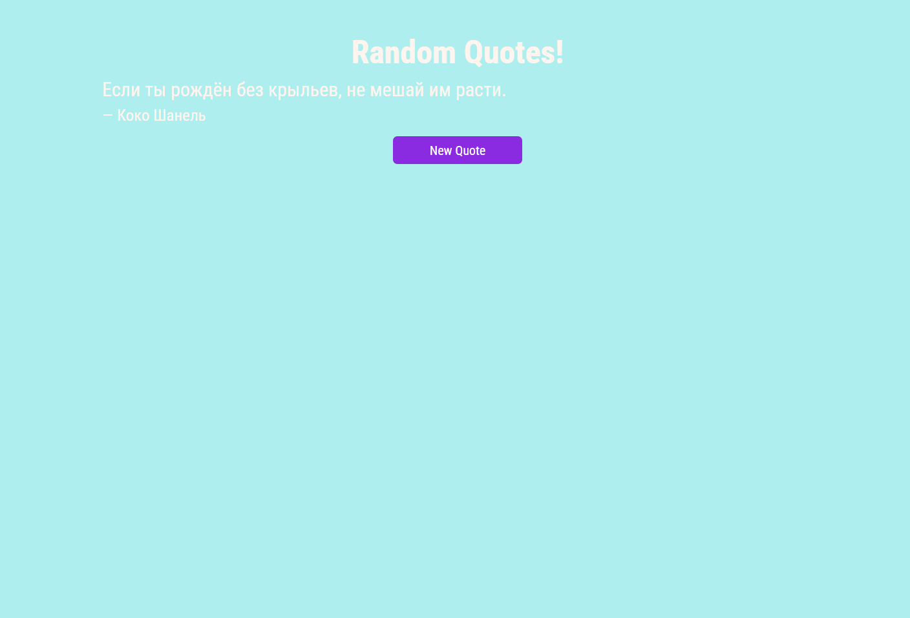

#  random-quote-machine

## Описание проекта
random-quote-machine -- это приложение на React, которое отображает случайные цитаты известных авторов. Запросы для получения цитат отправляются на API Forismatic.

## Функционал:
- Обновление цитаты при нажатии на кнопку
- Переключение цвета фона вместе с цитатой

## Установка и запуск проекта:
Клонировать репозиторий:

    git clone https://github.com/tv-tugova/random-quote-machine
.git

Установить зависимости:

    npm install

Запустить приложение:

    npm start

API Forismatic возвращает данные в формате JSONP, что позволяет обходить ограничения CORS.

## Скриншоты:

